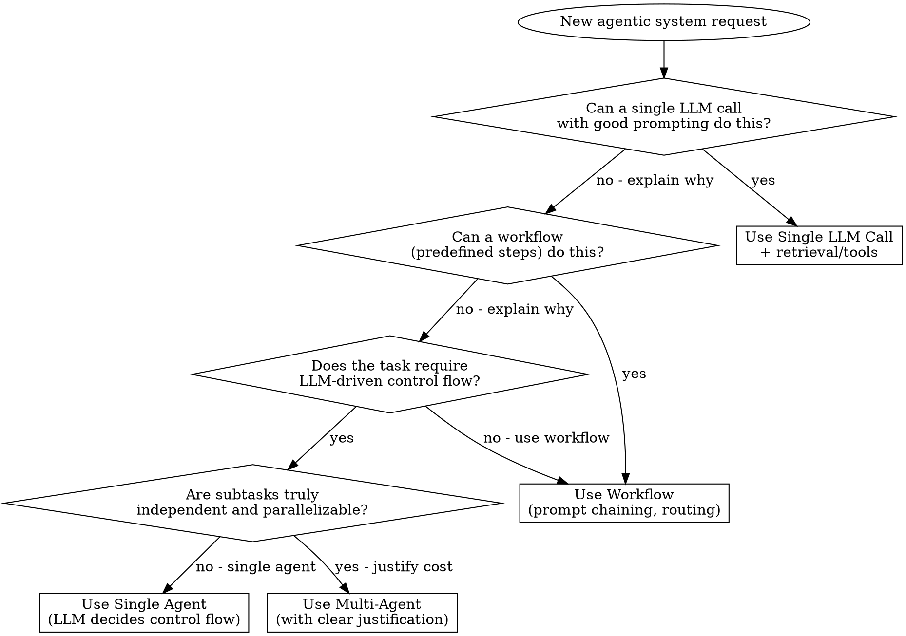

# Architecting Agentic Systems

## Overview

This skill synthesizes mental models from Harrison Chase (LangChain), Andrew Ng (DeepLearning.AI), Anthropic Applied Team, swyx (Latent Space), and Lilian Weng (ex-OpenAI) into a unified framework for designing agentic AI systems.

**Core principle**: Start simple. Prove simpler approaches fail before adding complexity. Agents are a last resort, not a default.

## The Iron Rule: Prove Baseline Fails First

**You MUST test simpler approaches before proposing complex ones.**

```
BASELINE TEST REQUIRED

Before recommending agents or multi-agent systems:
1. Describe what a single LLM call would do
2. Identify specifically WHY it would fail
3. Only then propose the next level of complexity

Skipping this step = architectural malpractice
```

**Why this matters**: In testing, a multi-agent recommendation (~$4.50/run, 300K tokens) was replaced by a simple workflow (~$1.20/run, 80K tokens) once the baseline question was asked. The "simpler" approach was also more reliable.

## The Simplicity-First Decision Flow



**Key insight (Harrison Chase)**: "People reach for subagents too soon. If your prompt is 20 lines, expand it—don't outsource it."

## Workflow vs Agent: The Critical Distinction

| Aspect | Workflow | Agent |
|--------|----------|-------|
| **Control flow** | Preset in code | LLM decides at runtime |
| **Predictability** | High - same path every time | Variable - depends on LLM reasoning |
| **Debugging** | Easy - check each step | Hard - "why did it do that?" |
| **Cost** | Lower - bounded steps | Higher - potential loops |
| **When to use** | Process is known, only content varies | Genuinely need dynamic decisions |

**The test question**: "Can I draw the entire decision tree in advance?"
- **Yes** → Workflow (even if LLMs power each step)
- **No** → Agent (LLM must decide what to do next)

**Anthropic**: "Workflows offer predictability and consistency for well-defined tasks."

### Anti-Pattern: Workflow Disguised as Agent

**Symptom**: Your agent's system prompt prescribes exact steps:
```
WORKFLOW:
1. First call tool A
2. Then call tool B
3. Then call tool C
4. Repeat until done
```

**Problem**: You built an agent loop, but the LLM isn't making decisions—it's following instructions. You pay agent costs (4x tokens, variable latency, debugging difficulty) for workflow benefits you're not getting.

**The tell**: If your prompt says "ALWAYS do X, THEN do Y, THEN do Z"—that's a workflow. Implement it as code:

```python
# Agent approach (expensive, unpredictable)
agent.run("Extract data following the workflow...")

# Workflow approach (cheaper, predictable)
data = extract_from_pdf(pdf)      # Step 1
data = enrich_with_linkedin(data)  # Step 2
memo = generate_memo(data)         # Step 3
```

**Rule**: If you can write the steps as a for-loop or sequence of function calls, it's a workflow—even if each step uses an LLM.

## Cost Reality Check

| Approach | Token Multiplier | Example Cost |
|----------|-----------------|--------------|
| Single LLM call | 1x | $0.75 |
| Workflow (3-5 steps) | 1.5-2x | $1.20 |
| Single agent | 4x | $3.00 |
| Multi-agent | 15x | $11.00+ |

**Anthropic data**: "Agents typically use 4x more tokens than chat, multi-agent uses 15x more."

At 100 runs/month: Single call = $75, Multi-agent = $1,100. **Justify the difference.**

## When External Enrichment is Justified

Adding external data sources (APIs, web scraping, databases) increases complexity, cost, and failure modes. Justify each source.

### The Enrichment Test

Before adding an external data source, answer:

| Question | Required Answer |
|----------|-----------------|
| What specific field does this source fill? | Named fields, not "general context" |
| Can the LLM infer this from existing data? | No—tested and confirmed |
| What's the accuracy gain in evals? | Measured, >5% on key metrics |
| What's the cost/latency increase? | Documented and acceptable |
| What happens when this source fails? | Graceful degradation defined |

### Enrichment Decision Matrix

| Source Type | Justification Needed | Example |
|-------------|---------------------|---------|
| **Core data** | Low - essential for task | PDF content for extraction |
| **Verification** | Medium - improves accuracy | LinkedIn to verify founder names |
| **Enhancement** | High - must prove value | Market data APIs, news |
| **Nice-to-have** | Very high - usually skip | Social media, reviews |

### Anti-Pattern: Enrichment Without Measurement

```
❌ "Let's add LinkedIn data to make it better"
✅ "LinkedIn data improved founder accuracy from 72% to 89% in evals"
```

**Rule**: If you can't point to eval results showing the enrichment helps, don't add it.

## IMPACT Checklist (swyx)

Before finalizing ANY agent architecture, verify all six elements:

| Element | Question to Answer | Red Flag if Missing |
|---------|-------------------|---------------------|
| **Intent** | What specific goal is encoded? How will you eval success? | Vague objectives lead to vague results |
| **Memory** | How does the agent remember across sessions? Within session? | Agent "forgets" context, repeats work |
| **Planning** | Is planning needed? If so, how constrained? | Unreliable planning = unpredictable agents |
| **Authority** | Who/what can the agent delegate to? What trust level? | "Stutter-step agents" that ask permission constantly |
| **Control Flow** | Is control flow preset (workflow) or LLM-driven (agent)? | Unclear boundaries = debugging nightmare |
| **Tools** | What tools? Are they designed for agents, not humans? | Poor tool design = agent failures |

## Design Evals BEFORE Architecture (Andrew Ng)

**"Disciplined evals is the single biggest predictor of whether someone executes well."**

Before designing architecture, define:

1. **What does success look like?** (specific, measurable)
2. **What are 3-5 failure modes you expect?**
3. **How will you detect each failure mode?**
4. **What's the minimum acceptable success rate?**

| Eval Type | When to Use | Example |
|-----------|-------------|---------|
| **Objective** | Output has verifiable properties | "Memo contains all required sections" |
| **Subjective (LLM-as-judge)** | Quality judgment needed | "Analysis is insightful" (use sparingly) |
| **Component-level** | Debug which stage fails | "Extraction accuracy" vs "Synthesis quality" |
| **End-to-end** | Overall system performance | "IC would approve this memo format" |

## Comparative Evaluation: Using Data to Decide

**Having evals is not enough. You must USE them to choose between approaches.**

### The Comparison Protocol

Before choosing agent over workflow (or workflow over single-call):

```
MANDATORY COMPARISON

1. Build BOTH approaches (baseline + proposed)
2. Run SAME eval suite on BOTH
3. Document: accuracy, cost, latency, reliability
4. Only choose complex approach if data justifies it
```

### Decision Thresholds

| Metric | Threshold to Justify Complexity |
|--------|--------------------------------|
| **Accuracy gain** | >10% improvement on key metrics |
| **Cost increase** | <3x for 10% gain, <5x for 20% gain |
| **Latency** | Acceptable for use case (batch vs real-time) |
| **Reliability** | Complex approach must be ≥95% as reliable |

### Example Comparison Table

| Approach | Accuracy | Cost/run | Time | Reliability |
|----------|----------|----------|------|-------------|
| Single-call | 78% | $0.02 | 3s | 99% |
| Workflow | 85% | $0.05 | 8s | 98% |
| Agent | 88% | $0.15 | 25s | 92% |

**Analysis**: Workflow gives 7% accuracy gain for 2.5x cost. Agent adds only 3% more for 3x additional cost and 6% reliability drop. **Choose workflow.**

### Red Flag: "We Haven't Compared"

If you can't fill in a comparison table like above, you haven't done the work. Go back and run the evals.

## Context Engineering Principles (Harrison Chase)

**"Context engineering is the #1 job of engineers building AI agents."**

| Principle | Application |
|-----------|-------------|
| Put complexity in prompt, not code | 2000-line system prompts are normal. Don't hide intent in abstractions |
| Use filesystem as memory | Models understand directories. Glob/grep for retrieval |
| Right information, right format | "Garbage in, garbage out" - agent can't read minds |
| Favor main agent when possible | Subagents = context isolation = coordination overhead |

## Safety and Reliability Checks (Lilian Weng + Anthropic)

Before deploying, verify:

- [ ] **Hallucination guards**: Agent cannot "fill in" missing data - must flag unknowns
- [ ] **Planning constraints**: If using planning, it's bounded (not open-ended AutoGPT-style)
- [ ] **Sandbox testing**: Tested in isolated environment before production
- [ ] **Human-in-the-loop**: Clear points where human reviews before consequential actions
- [ ] **Audit trail**: Can explain every decision the agent made
- [ ] **Cost bounds**: Token/API cost limits to prevent runaway loops

## Example: Pitch Deck → Investment Memo

**Task**: Build a system that converts startup pitch decks into IC-ready memos.

### Applying the Decision Flow

| Question | Answer | Reasoning |
|----------|--------|-----------|
| Single LLM call? | Could work for draft, but needs current market data | Test this as baseline first |
| Workflow? | **Yes** - process is fixed: extract → enrich → generate → review | Steps are predictable |
| LLM-driven control flow? | **No** - memo structure is standardized | No runtime decisions needed |
| Multi-agent? | **No** - not needed | Tasks aren't independent enough |

### Key Insight
> "The *content* requires intelligence. The *process* does not."

**Recommendation**: 5-step workflow, NOT multi-agent system.

### IMPACT Applied

| Element | Design |
|---------|--------|
| **Intent** | Transform deck → IC memo; eval = partner revision rate <30% |
| **Memory** | Store approved memos as few-shot examples |
| **Planning** | None - fixed workflow |
| **Authority** | LLM drafts, human approves |
| **Control Flow** | Preset workflow |
| **Tools** | PDF parser, web search (returns summaries, not raw pages) |

## When NOT to Use Agents

Prefer simpler approaches when:

- Task can be fully specified as a deterministic workflow
- Entire decision tree can be mapped in advance
- Reliability requirements are very high (>99%)
- Cost sensitivity is high
- Audit/explainability requirements are strict

**Anthropic**: "Finding the simplest solution possible... might mean not building agentic systems at all."

## Architecture Review Checklist

Before approving any agent architecture, ask:

1. **Baseline proof**: "What happens with a single LLM call? Why isn't that enough?"
2. **Workflow test**: "Can I draw the full decision tree? If yes, use workflow."
3. **IMPACT coverage**: "Are all 6 elements addressed?"
4. **Eval strategy**: "How will we know if this works? Defined BEFORE architecture?"
5. **Context design**: "Is the right information reaching the LLM?"
6. **Safety bounds**: "What's the worst this agent could do? Is it bounded?"
7. **Cost justification**: "Is the task valuable enough for agent overhead?"

## Expert Quick Reference

| Expert | Key Principle | When It Applies |
|--------|--------------|-----------------|
| **Anthropic** | Start simple, add complexity only when failures demand it | Always - first question for any design |
| **Harrison Chase** | Context engineering > architecture engineering | When agent outputs are wrong |
| **Andrew Ng** | Evals predict success more than architecture | Before any implementation |
| **swyx** | IMPACT: don't forget Memory, Authority, Trust | Reviewing completeness |
| **Lilian Weng** | Planning is powerful but unreliable | When considering autonomous planning |

## Red Flags - Stop and Reconsider

If you catch yourself thinking:

| Thought | Reality |
|---------|---------|
| "Multi-agent is obviously better for complex tasks" | Prove simpler fails first. Complexity ≠ capability. |
| "Let's add another agent for X" | Can the main agent's prompt handle it? Expand to 2000 lines before adding agents. |
| "We need autonomous planning" | Planning is "less mature, less predictable" (Ng). Constrain it. |
| "We'll figure out evals later" | Evals come BEFORE architecture. This predicts success. |
| "The agent will figure it out" | Agents can't read minds. Context engineering is YOUR job. |
| "This task is too complex for a workflow" | If you can draw the decision tree, it's a workflow. |
| "Specialized agents = better quality" | Specialization = context isolation = coordination bugs. |
| "My prompt tells the agent exactly what to do" | That's a workflow disguised as an agent. Implement as code. |
| "We haven't compared approaches yet" | No comparison = no justification. Run the evals first. |
| "Enrichment obviously improves quality" | Prove it. Compare baseline (no enrichment) vs enriched in evals. |

## Implementation Approach

**Phase 1: Prove the Baseline**
- Build single-call version with comprehensive prompt
- Run on test cases where you have expected outputs
- Measure: accuracy, cost, latency, reliability
- **GATE**: Record baseline metrics before proceeding

**Phase 2: Add Complexity Only Where Baseline Fails**
- Identify SPECIFIC failures (which fields? which cases?)
- Add MINIMAL fix (one step, one enrichment source)
- Re-run SAME evals
- **GATE**: Must show >5% improvement to keep the addition
- Document WHY each step was added with eval evidence

**Phase 3: Compare Approaches**
- If you built an agent, also build workflow version
- Run same evals on both
- **GATE**: Fill in comparison table (see Comparative Evaluation section)
- Choose approach based on data, not intuition

**Phase 4: Harden**
- Add hallucination guards
- Add cost bounds and circuit breakers
- Add human-in-the-loop at high-stakes decisions
- Build feedback loop for continuous improvement

### Implementation Checklist

Before declaring "done", verify:

- [ ] Baseline metrics recorded
- [ ] Each addition justified by eval improvement
- [ ] Comparison table filled (if multiple approaches built)
- [ ] Final approach chosen based on data
- [ ] Evals run on final implementation
- [ ] Cost/accuracy tradeoff documented and accepted
